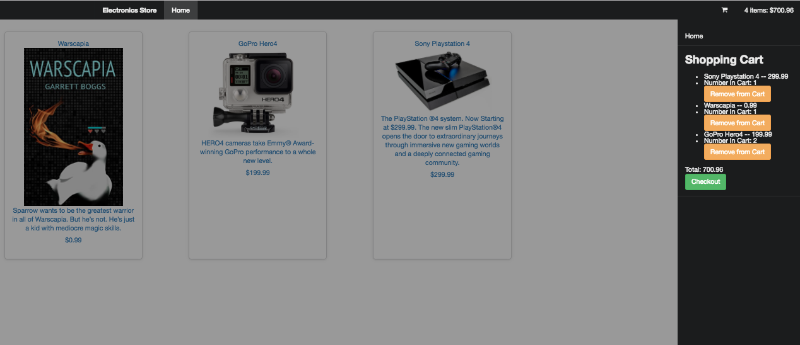

# _Electronics Store_

## Description
_An Electronics Store web application where users can add and checkout items in basket. This will modify the store's decrease inventory as soon as checkout is complete._

#### _11/3/2016_

#### By _**Stephen Burden**_

[Click here to view live](https://electronics-store.pagefrontapp.com/)

## Prerequisites

_You will need the following things properly installed on your computer._

* _[Git](http://git-scm.com/)_
* _[Node.js](http://nodejs.org/) (with NPM)_
* _[Bower](http://bower.io/)_
* _[Ember CLI](http://ember-cli.com/)_

## Installation

* `git clone https://github.com/amcmerrell/shopping-site-ember`
* `cd shopping-site-ember`
* `npm install`
* `bower install`

## Running / Development

* `ember serve`
* _Visit your app at [http://localhost:4200](http://localhost:4200)._

## Known Bugs
_There are currently no known bugs for this project. If you discover any issues, you can reach me via the contact details below._

## Support and contact details
_If you have any questions about this project, please contact Stephen at spburden@hotmail.com_

## Technologies Used
* _JavaScript_
* _Ember_
* _Firebase_
* _Semantic UI_
* _Sass_
* _HTML_

### License

*This webpage is licensed under the MIT license.*

Copyright (c) 2016 **_Stephen Burden_**
